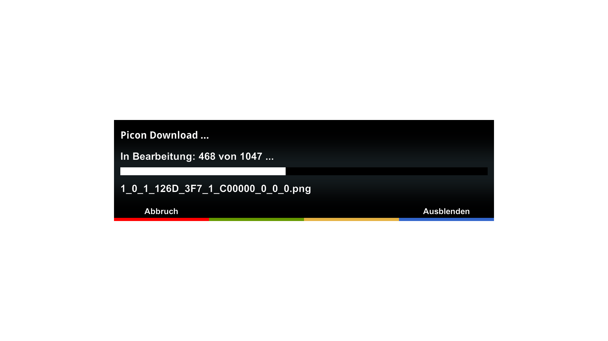

# PiconCockpit (PIC)

## Features
PiconCockpit is a plugin for DreamOS receivers that downloads picons from a picon server.

## Limitations
- PIC is being tested on DM 920 and DM ONE only

## Languages
- english
- german
- italian (by Spaeleus)

## Links
- Installation: https://dream-alpha.github.io/PiconCockpit
- Support: https://github.com/dream-alpha/PiconCockpit/discussions
- Feed: https://gemfury.com/dream-alpha
